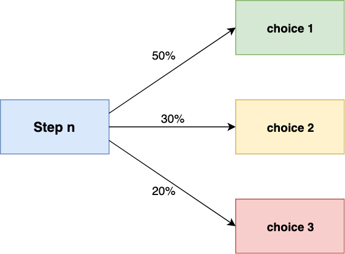
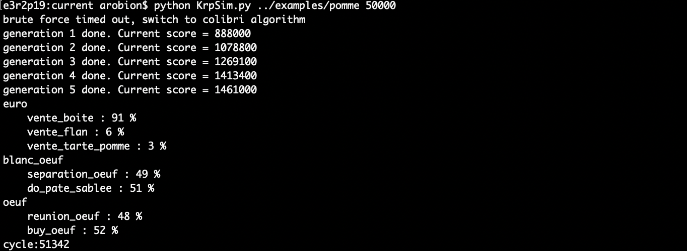
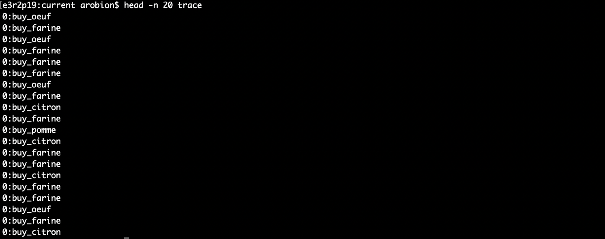

[](https://www.python.org/downloads/release/python-360/)

# krp_sim

## Introduction

The krpsim project main objective is to discover optimization of a ressource graph. A ressource graph is composed of ressources that can be used to build products. Ressources can be used by different processes and are associated with a process time. The idea is to optimize the production of the wanted product with the given ressources and time.

The files are formatted as follow :
```
euro:10

achat_materiel:(euro:8):(materiel:1):10
realisation_produit:(materiel:1):(produit:1):30
livraison:(produit:1):(client_content:1):20

optimize:(time;client_content)
```

## Algorithm

The first approach is `brute force`. It will try every ressources repartition in all processes and if it takes more than 3 seconds a second approach will be taken.

The second approach is `multi_agent`. It uses several agents (with multi processing) threw different generations. Agents are going to randomly select a path to create the specified product (all path chosen by agents are valid, they allow to create the specified ressources). At the beginning of the multi_agent approach the ressource repartition is equivalent for each path. 

<p align="center">

<p/>

When an agent is created, it will randomly differ from the generation repartition.

<p align="center">

<p/>

At the end of a generation, the best agent is chosen a basis for the next generation. This allows us to optimize the repartition threw the different generations.

## Program

<p>

<p/>

At the end of the process, a trace file is created to list all steps needed to have the result calculated.

<p>

<p/>

### Final mark (115/115)